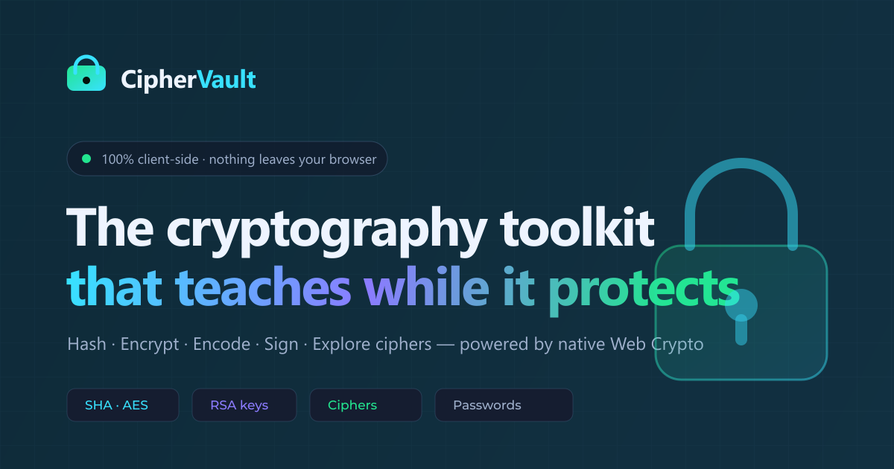

# 🔐 CipherVault

**A secure, interactive cryptography toolkit for learners and professionals.**
Hash, encrypt, encode, sign, and explore classic ciphers in real time — 100% client-side, powered by the browser's native **Web Crypto API**. Nothing ever leaves your device.

### 🌐 [**Live demo → cipher-vault-vert.vercel.app**](https://cipher-vault-vert.vercel.app/)



---

## ✨ Features

| Tool | What it does | Under the hood |
|------|--------------|----------------|
| **Hashing** | Live MD5 / SHA-1 / SHA-256 / SHA-384 / SHA-512 as you type | `crypto.subtle.digest` (+ tiny JS MD5 for the legacy demo) |
| **Encoder** | Base64 / Hex / URL / Binary, both directions | UTF-8 safe, fully reversible |
| **AES Vault** | Real authenticated encryption with a passphrase | **AES-256-GCM** + **PBKDF2** (250k SHA-256 rounds, random salt & IV) |
| **Ciphers** | Caesar, ROT13, Atbash, Vigenère, XOR | Classic substitution — great for teaching, unsafe for real use |
| **Passwords** | Entropy-based strength meter + secure generator | `crypto.getRandomValues()` CSPRNG, offline crack-time estimate |
| **RSA Keys** | 2048-bit key pair generation, encrypt/decrypt, sign/verify | **RSA-OAEP** (encryption) + **RSA-PSS** (signatures), PEM export |

Each tool ships with a plain-English **"how it works"** explainer — turning a utility into a hands-on cryptography lesson.

---

## 🎯 Design & quality

- **Two first-class themes** — OLED-dark by default with a properly-contrasted (WCAG AA) light mode. Toggle persists via `localStorage` with an anti-flash inline script.
- **Elegant, performant motion** — animated gradient orbs, a matrix-rain canvas (auto-disabled on light mode and for `prefers-reduced-motion`), and scroll-reveal via `IntersectionObserver`.
- **Responsive** — from a 375px phone to ultrawide, no horizontal scroll, tabs reflow, 44px touch targets, full keyboard navigation (arrow keys on the tab list).
- **Zero dependencies** — three static HTML pages plus one small stylesheet and two readable scripts. No frameworks, no trackers, no build step, no supply chain.
- **Accessible** — semantic landmarks, ARIA roles/labels, visible focus rings, `aria-live` toasts.

---

## 📁 Structure

CipherVault is a **multi-page static site** — no build step, no framework.

```
index.html          # Home / landing page
toolkit.html        # The six-tool secure console
learn.html          # Cryptography 101 guide
assets/
  styles.css        # Shared stylesheet (light + dark themes)
  site.js           # Shared: nav, theme toggle, scroll-reveal, matrix rain
  tools.js          # The six crypto tools (loaded on toolkit.html only)
og-image.png        # 1200×630 social share card
og-image.svg        # Editable source for the card
```

`site.js` runs on every page and is fully guarded, so missing elements never throw. `tools.js` self-guards and only executes on the toolkit page.

## 🚀 Usage

There is no build step. Because the pages load `assets/` via relative paths, serve the folder over HTTP (recommended) rather than `file://`:

```bash
npx serve .          # then open http://localhost:3000
```

Any static host works. Once loaded, every page works **fully offline**.

---

## 🌐 Deploying

This project is live on **Vercel** at **[cipher-vault-vert.vercel.app](https://cipher-vault-vert.vercel.app/)** — every push to `main` auto-deploys. It's a plain static site, so any static host works.

The SEO + social-share metadata (canonical links, Open Graph `og:url`/`og:image`, Twitter/JSON-LD tags) already points at the live domain. If you fork this and deploy to a **different** URL, find & replace `https://cipher-vault-vert.vercel.app/` with your own domain across the HTML pages.

Files to upload:

```
index.html  toolkit.html  learn.html
assets/styles.css  assets/site.js  assets/tools.js
og-image.png  og-image.svg
```

### Regenerating the social card

`og-image.png` is generated from `og-image.svg`:

```bash
npx -y sharp-cli -i og-image.svg -o . -f png resize 1200 630
```

---

## 🔒 Security notes

- All cryptographic operations run **locally in your browser** — verify it yourself in the network inspector (no requests are made after the page and fonts load).
- **AES / RSA keys and plaintext never touch a server.** RSA key pairs are generated in-browser and exist only for the session.
- Legacy algorithms (MD5, SHA-1) and classic ciphers are included **for education and comparison only** — never use them for real security.
- This is an educational toolkit and **not a substitute for audited, production key management.**

---

## 🛠 Tech

Vanilla HTML / CSS / JavaScript · Web Crypto API · Inter + JetBrains Mono (Google Fonts) · no framework.

© 2026 CipherVault · Educational cryptography toolkit.
